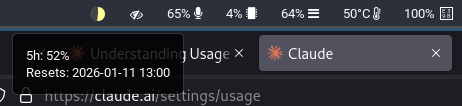

# waybar-claude

A simple waybar module that displays your Claude Code usage as a pie chart.



Shows your 5-hour rolling window utilization with color-coded thresholds:
- **Green** (0-50%) - plenty of capacity
- **Yellow** (50-85%) - moderate usage
- **Orange** (85-100%) - approaching limit
- **Red** (100%) - limit reached

## Requirements

- Python 3 (no external dependencies)
- ImageMagick (for generating sprites)
- [Claude Code](https://claude.ai/claude-code) with OAuth credentials
- Waybar

## Installation

1. Clone this repo somewhere:
   ```bash
   git clone https://github.com/YOUR_USERNAME/waybar-claude.git ~/.local/share/waybar-claude
   ```

2. Generate the sprite sheet:
   ```bash
   ~/.local/share/waybar-claude/claude-usage.py --generate-sprites
   ```

3. Generate CSS and add it to `~/.config/waybar/style.css`:
   ```bash
   ~/.local/share/waybar-claude/claude-usage.py --generate-css >> ~/.config/waybar/style.css
   ```

   Or copy the output manually if you prefer.

4. Add the module to your `~/.config/waybar/config`:
   ```json
   "modules-right": ["custom/claude", ...]
   ```

   And add the module definition:
   ```json
   "custom/claude": {
       "format": "{}",
       "return-type": "json",
       "interval": 60,
       "exec": "~/.local/share/waybar-claude/claude-usage.py"
   }
   ```

5. Reload waybar:
   ```bash
   killall waybar && waybar &
   ```

## How it works

The script reads your OAuth token from `~/.claude/.credentials.json` (created by Claude Code) and queries the Anthropic API for your current usage.

A pre-generated sprite sheet contains pie chart icons at 5% increments. The script outputs a CSS class (e.g., `p85`) that waybar uses to display the correct icon via `background-position`.

Hover over the icon to see the exact percentage and reset time.

## Commands

```bash
claude-usage.py                  # Fetch usage, output waybar JSON
claude-usage.py --generate-sprites  # Generate sprite sheet PNG
claude-usage.py --generate-css      # Print CSS rules for sprite sheet
claude-usage.py --help              # Show help
```

## Configuration

Edit `claude-usage.py` to customize:
- Color values (`GREEN`, `YELLOW`, `ORANGE`, `RED`)
- `ICON_SIZE` - size of each icon (default 16px)
- `STEP` - percentage granularity (default 5%)

After changing colors or sizes, regenerate the sprite sheet.

## License

MIT
